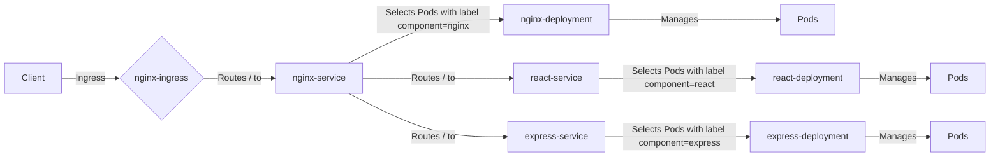

### minikube
```yaml
minikube start --cpus 4 --memory 5943
```

<aside> 💡 TIP. minikube start 명령어의 –cpus, –memory 및 –disk-size 플래그는 각각 클러스터에 할당할 CPU 수, 메모리 용량, 디스크 용량을 뜻합니다. 실습 환경의 하드웨어 스펙에 따라 클러스터에 할당할 리소스를 조절하기 바랍니다.

</aside>


## Kubernetes의 Ingress, Service, 그리고 Deployment에 대해 간단하게 설명해보기
### 설명
1. **Deployment**: Deployment는 Kubernetes에서 애플리케이션을 배포하는 기본 메커니즘입니다. Deployment는 애플리케이션의 상태를 정의하고, Kubernetes가 이 상태를 유지하도록 지시합니다. 예를 들어, Deployment는 특정 Docker 이미지를 기반으로 한 Pod의 수, 업데이트 전략 등을 정의합니다.

2. **Service**: Service는 네트워크 경로를 추상화하여 하나 이상의 Pod에 접근할 수 있는 방법을 제공합니다. Service는 Deployment에 의해 관리되는 Pod 집합에 대한 로드 밸런싱, 서비스 검색, 포트 노출 등을 처리합니다.

3. **Ingress**: Ingress는 클러스터 외부에서 내부 서비스로의 HTTP와 HTTPS 경로를 관리합니다. 이를 통해 외부 클라이언트가 내부 서비스에 접근할 수 있습니다. Ingress는 일반적으로 Ingress Controller와 함께 사용되며, 이는 종종 리버스 프록시 역할을 합니다.
### 작동방식
1. **Deployment 생성**: 애플리케이션의 상태를 정의하고, 이를 유지하기 위해 Kubernetes에 지시합니다. 이 상태에는 실행할 Pod의 수, 사용할 Docker 이미지, Pod의 업데이트 전략 등이 포함됩니다.

2. **Service 생성**: Deployment에 의해 생성된 Pod에 대한 네트워크 액세스를 제공합니다. 이는 클러스터 내에서 다른 Pod나 클러스터 외부의 클라이언트가 Pod에 접근할 수 있게 합니다.

3. **Ingress 생성**: 클러스터 외부에서 내부 Service로의 네트워크 경로를 제공합니다. 이를 통해 외부 클라이언트가 Service에 접근할 수 있게 됩니다.
### Ingress 설정 파일에서 주로 설정하는 항목
- **metadata.name**: Ingress 리소스의 이름입니다.
- **spec.rules.host**: 클라이언트의 HTTP 요청에서 호스트 헤더를 기반으로 요청을 라우팅합니다.
- **spec.rules.http.paths.path**: 클라이언트의 HTTP 요청에서 URL 경로를 기반으로 요청을 라우팅합니다.
- **spec.rules.http.paths.backend.service.name**: 요청을 라우팅할 Service의 이름입니다.
- **spec.rules.http.paths.backend.service.port.number**: 요청을 라우팅할 Service의 포트 번호입니다.

## 각 파일들의 관계성
1. **Deployment**:

    - `react-deployment`, `express-deployment`, `nginx-deployment`는 각각 React, Express, Nginx 애플리케이션을 배포하는 Deployment입니다.
    - 각 Deployment는 `replicas` 필드를 통해 Pod의 수를 정의합니다.
    - `selector.matchLabels`는 Deployment가 관리할 Pod를 선택하는 데 사용되는 레이블을 정의합니다.
    - `template`는 새 Pod를 생성할 때 사용되는 템플릿을 정의합니다.
2. **Service**:

    - `react-service`, `express-service`, `nginx-service`는 각각 React, Express, Nginx 애플리케이션에 대한 Service입니다.
    - 각 Service는 `selector`를 통해 연결할 Pod를 선택합니다. 이는 Deployment의 `selector.matchLabels`와 일치해야 합니다.
    - `ports`는 Service가 리스닝할 포트와 Pod가 리스닝할 포트를 정의합니다.
3. **Ingress**:

    - `nginx-ingress`는 Ingress 리소스로, 클러스터 외부에서 내부 Service로의 네트워크 경로를 제공합니다.
    - `spec.rules.http.paths`는 클라이언트의 HTTP 요청을 어떤 Service로 라우팅할지 결정합니다. 여기서는 `nginx-service`로 모든 요청을 라우팅합니다.

이렇게 보면, Deployment는 Pod를 생성하고 관리하며, Service는 이러한 Pod에 네트워크 액세스를 제공합니다. 그리고 Ingress는 클러스터 외부에서 이러한 Service로의 네트워크 경로를 제공합니다. 이 모든 것이 함께 작동하여 외부 클라이언트가 Kubernetes 클러스터 내의 애플리케이션에 접근할 수 있게 합니다.


### aa
```yaml
kubectl get pod -n kube-system
```

<aside> 💡 이제 kubectl을 사용해서 클러스터와 상호작용 할 수 있습니다. kubectl get pod -n kube-system 명령어를 실행해 kube-system 네임스페이스의 파드(pod)를 확인합니다. 아래와 같은 출력 결과가 표시됩니다.

</aside>

### 클러스터에 배포
```shell
kubectl apply -f ./app.yaml # 배포

kubectl delete -f ./app.yaml # 삭제
```

> https://github.com/GoogleCloudPlatform/microservices-demo/blob/main/release/kubernetes-manifests.yaml


```shell
### 클러스터에 파드가 정상적으로 배포되었는지 확인
kubectl get pods
```
### Namespace에서 모든 리소스 삭제
```shell
kubectl delete all --all
```

### minikube service 실행
```
minikube service nginx-service
```

## minikube
### ingress.yaml
```yaml
apiVersion: networking.k8s.io/v1
kind: Ingress
metadata:
  name: nginx-ingress
spec:
  rules:
  - host: your-domain.com  # 여기에 도메인을 입력하세요 Minikube에서는 특정 도메인 이름을 사용할 필요가 없으므로, `host` 필드를 생략할 수 있습니다.
    http:
      paths:
      - pathType: Prefix
        path: "/"
        backend:
          service:
            name: nginx-service # 노출하고싶은 service
            port:
              number: 80 # 노출하고싶은 service의 포트
```
### minikube ingress 실행
```shell
minikube addons enable ingress # 사전에 ingress를 사용가능하도록 설정한다.
```

```
kubectl run --image curlimages/curl:7.68.0 -it --restart Never --rm curl sh
```


## 관계도

